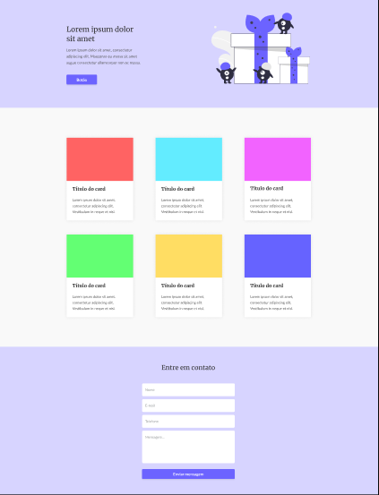

# Codelândia - Desafio 03

Esta é uma solução para o [Codelândia - Desafio 03](https://www.figma.com/file/Yb9IBH56g7T1hdIyZ3BMNO/Desafios---Codel%C3%A2ndia?node-id=3743%3A36&t=YR4cB86hj0EVFQ5y-0).

## Visão geral

### O desafio

O desafio é construir um site a partir do layout do Figma apresentado, também deixá-lo responsivo.

### Captura de tela

### Links

- [Projeto pronto](https://allanjrcorrea.github.io/Codelandia-Desafio-03/)

## Meu processo

### Construído com

- HTML
- CSS

### O que eu aprendi

Reforcei meus conhecimentos de HTML e CSS e Responsividade.

## Author

- LinkedIn - [Allan](https://www.linkedin.com/in/allanajc/)